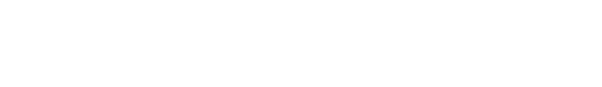

<p align="center"></p>
<p align="center">
  <a href="https://noclocks.dev">Website</a> |
  <a href="https://blog.noclocks.dev">Blog</a> |
  <a href="https://docs.noclocks.dev">Documentation</a> |
  <a href="https://cal.com/team/noclocks">Contact/Schedule</a> |
  <a href="https://github.com/sponsors/noclocks">Sponsor</a>
</p>
<p align="center">No Clocks, LLC Website (https://noclocks.dev) built using React, TypeScript, and ...</p>
<p align="center">
 
</p>

# No Clocks, LLC Website

> [!NOTE]
> [No Clocks, LLC](https://github.com/noclocks) is a new, cutting-edge, technology-based agency startup that seamlessly blends the expertise of seasoned Software Engineers, Web Developers, Data Engineers.

## Contents

- [Overview](#overview)
- [Repository](#repository)
  - [Project Structure](#project-structure)
- [Features](#features)
- [Technologies](#technologies)
  - [Tech Stack](#tech-stack)
- [Getting Started](#getting-started)
  - [Installation](#installation)
  - [Environment](#environment)
  - [Deployment](#deployment)
- [Contributing](#contributing)
- [License](#license)


## Overview

[No Clocks, LLC](https://github.com/noclocks) is an avant-garde technology-based agency that brings together a dynamic team of Software Engineers, Web Developers, and Data Engineers. We thrive on innovation and our proficiency spans a multitude of programming languages and frameworks, making us a formidable force in technology consulting and development across various industries.

## Features

- **Dynamic Web Presence**: Our website is designed to be responsive, engaging, and informative, providing an in-depth look at our services and the unique value we bring to our clients.
- **Interactive API**: We use a custom-built API for dynamic content delivery and integration with backend services.
- **Database Integration**: Ensuring smooth data flow and security with our robust database administration.
- **Infrastructure as Code (IaC)**: Leveraging modern DevOps practices to streamline and automate our cloud infrastructure.

## Technologies

This project is built using a mix of cutting-edge technologies that include:

- **Modern Frontend Frameworks**:
- **Backend Technologies**:
- **Cloud Hosted Services**:
- **Database and Content Management**:
- **Third-Party API Integrations**:
- **Artificial Intelligence Tooling**:

## Repository

This repository houses the codebase for our official website hosted at <https://noclocks.dev>.

It serves as a digital showcase of our expertise and the services we offer, reflecting our commitment to excellence and our journey towards becoming an engineering powerhouse.

### Project Structure

`#TODO`

The project structure is as follows:

```plaintext
.
├── .github
│   └── workflows
│       └── build.yml
├── .gitignore
├── LICENSE
```

### Tech-Stack

- [Node.js]() | [Bun.js]()
- [React.js]() 
- [TypeScript]() | [JavaScript]()
- [Vite.js]()
- [Vercel]()
- [Google Cloud Platform]()
- [Docker]()

## Getting Started

### Installation

To get started with the repository locally, first clone and install the repository:

```bash
git clone https://github.com/noclocks/noclocks.dev
cd noclocks.dev
bun install
```

if you prefer to use `npm`, `yarn`, or `pnpm`, replace `bun` with the preference package manager.

### Environment

Next, setup your local environment variables:

```bash
cp .env.example .env
```

and populate `.env`:

`#TODO`

```plaintext
...
```

### Run Locally

`#TODO`

### Deployment

`#TODO`

### Technical Documentation

`#TODO`

### Testing

`#TODO`

## Contributing

We welcome contributions from the community, whether it's fixing bugs, improving the documentation, or proposing new features. Please read [CONTRIBUTING.md]() for details on our code of conduct and the process for submitting pull requests to us.

## Contact Us

- **Email**: [dev@noclocks.dev](mailto://dev@noclocks.dev)
- **Phone**: [+1 (678) 491-4856](tel://+16784914856)

## Connect

## Connect with Us

-   [LinkedIn](https://linkedin.com/company/noclocks)
-   [Twitter](https://twitter.com/noclocksdev)
-   [Stack Overflow]()
-   [YouTube]()
-   [GitHub Discussions]()

Join us in redefining what's possible in technology and consulting by partnering with No Clocks, LLC – where technical prowess meets entrepreneurial vigor!

***

## Root Files

The root of the project contains the following files:

- [`.gitignore`](./.gitignore): A default `.gitignore` file that can be used to ignore common files and directories. Currently it ignores typical files and directories for the following languages or frameworks:
  - Windows (i.e. `Thumbs.db`, `desktop.ini`, `.lnk` files, etc.)
  - macOS (i.e. `.DS_Store` files)
  - Python (i.e. `.venv`, `.pyc`, `.pyo`, etc.)
  - Node.js (i.e. `node_modules`, `npm-debug.log`, etc.)

- [`.gitattributes`](./.gitattributes): A default `.gitattributes` file that can be used to specify attributes for the repository. Currently it applies attributes associated with the following languages or frameworks:
  - General Commonly Used Attributes
  - Markdown
  - PowerShell
  - Python
  - Web Development (i.e. HTML, CSS, JavaScript, etc.)

- [`.editorconfig`](./.editorconfig): A default `.editorconfig` file that can be used to define and maintain consistent coding styles between different editors and IDEs.

- [`LICENSE.md`](./LICENSE.md): No Clocks Default Open Source License: [Unlicense](https://unlicense.org/).

- [`README.template.md`](./README.template.md): A template for the actual project's `README.md` file that can be used to provide information about the project.

- [`CHANGELOG.md`](./CHANGELOG.md): A default `CHANGELOG.md` file that can be used to provide a log of all changes made to the project.

## GitHub

The `.github` directory contains the following files:

- `dependabot.yml`: A default `dependabot.yml` file that can be used to configure Dependabot for the repository.

- `workflows`: A directory that contains GitHub Actions workflows for the repository. Currently it contains the following workflow:
